# Ethical Hacking : Accessing a Website Admin Panel with SQL Injection

## Project Objective
My goal for this project was to **ethically** perform attacks to access a website admin panel. This means I only targeted a controlled environment where I had permission to test, ensuring everything was legal and safe. I used **DVWA (Damn Vulnerable Web Application)** to practice hacking techniques. My focus was on **SQL injection** and **login bypass attacks**, and I used an automated tool called **SQLMap** to help me. I’ll document the vulnerabilities I found, the step-by-step attack process, and suggest ways to fix these issues (mitigations).

---

## Vulnerability Identified
- **What did I find?**
- The `id` parameter in the SQL Injection module (`http://localhost/DVWA/vulnerabilities/sqli/`) was vulnerable to SQL injection.
- **Details**:
- The form didn’t sanitize user input, meaning the `id` value was directly inserted into a database query.
- SQLMap confirmed the vulnerability using techniques like boolean-based blind, error-based, and UNION query injections.
- This allowed me to extract the entire `users` table, including the admin’s password hash.
- **Why is this bad?** An attacker could use this vulnerability to steal sensitive data (like user credentials) or even take over the website.

### Key Concepts
- **SQL Injection**: This is an attack where I trick a website’s database into running harmful commands. 
- **Login Bypass**: This is a way to log in without knowing the real password, often by using SQL injection to trick the login system.
- **Injection Points**: These are places in a website (like input forms) where I can try to insert malicious code.
- **SQLMap**: A free tool that automates SQL injection attacks, making it easier for me to find and exploit vulnerabilities.


---

## Environment
Before I could start hacking, I needed to set up a safe place to practice. I used DVWA, a web application on Metasploitable2 with intentional vulnerabilities for learning. I used my attacker machine (192.168.56.108) to ping the target (192.168.56.104) making sure both systemscould communicate on the same host-only network.

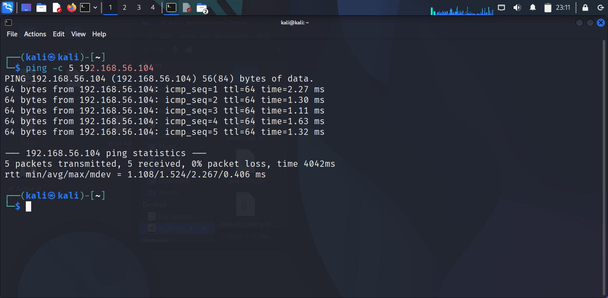

### DVWA Security Level
- **What’s the security level?** DVWA has different levels (Low, Medium, High, Impossible) that control how easy it is to exploit vulnerabilities.
- **Why did I set it to Low?** The Low level has no protections, making it easier for me to learn how attacks work.
- **Steps**:
  1. I logged in to DVWA with `admin/password`.
  2. On the left sidebar, I clicked “DVWA Security”.
  3. I set the security level to **Low** and clicked “Submit”.

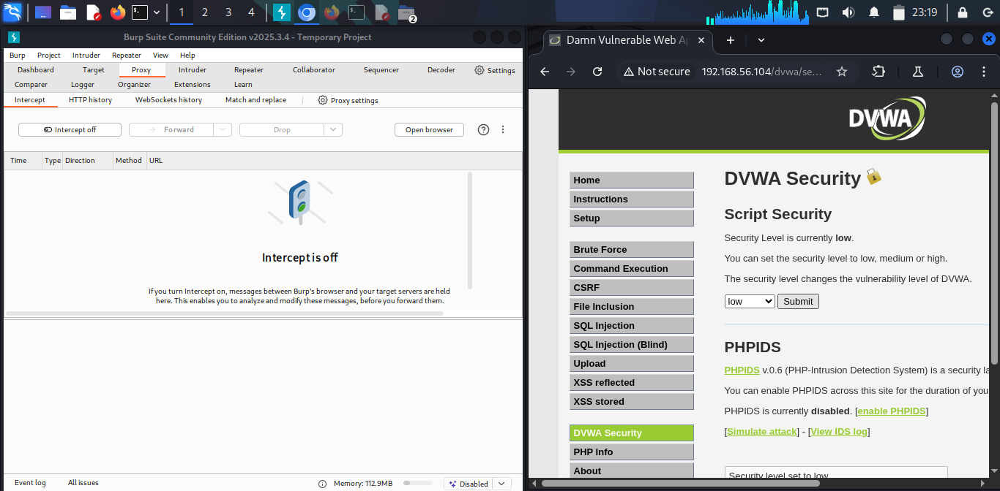

---

## Tools
In my Cisco Ethical Hacker course final Capstone CTF Project, I used manual injection techniques. This time, I needed two tools to automate my attacks: **SQLMap** and **Burp Suite**.
- **What is SQLMap?** SQLMap is a tool that automates SQL injection attacks. It can find injection points, extract data from databases, and even crack password hashes.
- **Why did I need it?** It saved me time by doing the hard work of testing for SQL injection vulnerabilities.

- **What is Burp Suite?** Burp Suite is a tool for intercepting and analyzing web traffic. It helped me capture requests (like form submissions) to use with SQLMap.
- **Why did I need it?** I needed to see the exact request a website sends so I could test it for vulnerabilities.

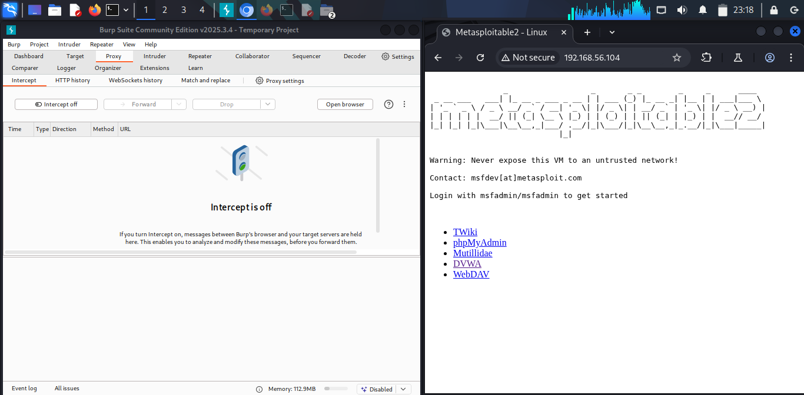

---

## Attack Process
Here’s the detailed process of how I performed the attack:

### Attempted a Login Bypass Attack (Failed)
- I first tried to bypass the login form using SQL injection. I wanted to log in as `admin` without knowing the password.
- Many real-world websites have weak login forms, and this attack would show how attackers can exploit them.

### Capturing Login Request
- I used Burp Suite to capture the login form’s request.
- I needed to know the exact parameters (like `username` and `password`) to test with SQLMap.
- **Steps**:
  1. I opened Burp Suite and made sure the proxy was active (Intercept was on).
  2. In my browser, I went to `http://192.168.56.104/DVWA/login.php`.
  3. I logged out of DVWA by clicking “Logout”.
  4. I entered test credentials (Username: `happy`, Password: `sad`) and clicked “Login”.
  5. In Burp Suite’s “Proxy” tab, I saw the intercepted request:
 
     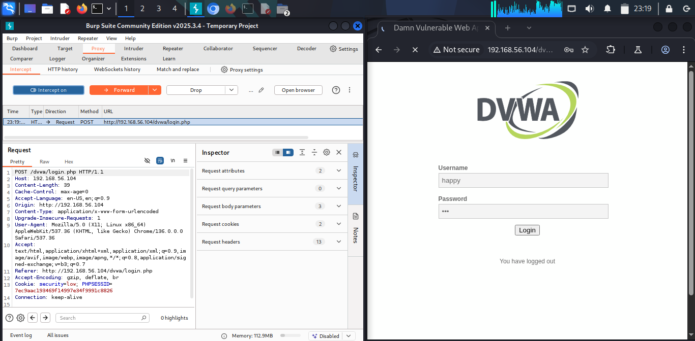

  7. I copied the URL (`http://localhost/DVWA/login.php`) and the parameters. I also noted the `Cookie` value, which included `security=low` and my `PHPSESSID`.

### Tested the Login Form with SQLMap
- I used SQLMap to test if the login form was vulnerable to SQL injection.
- If the login form was vulnerable, I could bypass authentication and log in as `admin`.
- **Steps**:
  1. I opened a terminal.
  2. I ran SQLMap with the captured request:
 
    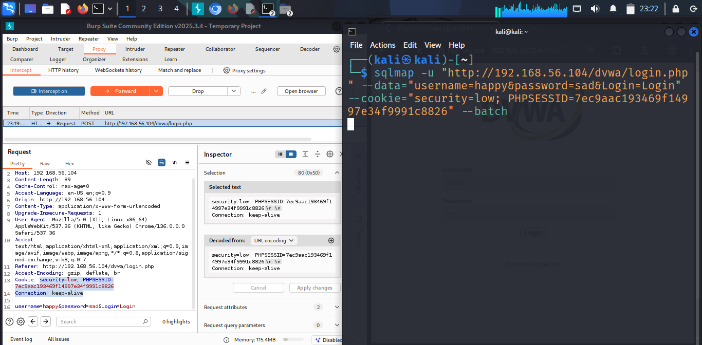
  
     - `-u`: The URL of the login form.
     - `--data`: The parameters sent in the POST request.
     - `--cookie`: The cookie value to keep my session active and security level low.
     - `--batch`: Automatically answers SQLMap’s prompts with default options.
  3. SQLMap tested the parameters (`happy` and `sad`) for SQL injection vulnerabilities.

### Result: Parameters Not Injectable
- SQLMap reported:

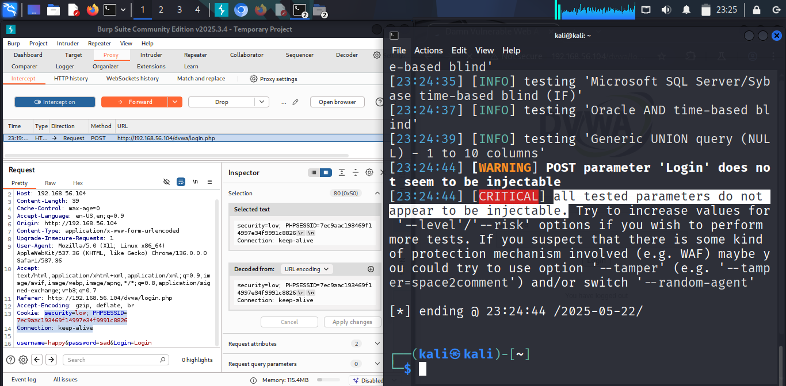

- SQLMap couldn’t find a way to inject SQL code into the login form. This might have happened because:
     - The login form didn’t return clear error messages for SQLMap to detect vulnerabilities.
     - There might have been a minor protection even on Low security level, or SQLMap’s default settings weren’t aggressive enough.
- Since the login bypass failed, I decided to try a different approach: using DVWA’s SQL Injection module to extract admin credentials.

---

## SQL Injection Attack (Successful)
Since the login bypass didn’t work, I used DVWA’s SQL Injection module to extract admin credentials, which I could then use to log in.

### SQL Injection Module
- I went to a part of DVWA designed for practicing SQL injection.
- This module has a form that’s intentionally vulnerable, making it a good place for me to learn.
- **Steps**:
1. I logged in to DVWA with the default credentials (`admin/password`) at `http://192.168.56.104/DVWA/login.php`.
2. On the left sidebar, I clicked “SQL Injection”. This took me to `http://192.168.56.104/DVWA/vulnerabilities/sqli/`.
3. I saw a form asking for a “User ID”. This form was an **injection point**. A place where I could try to inject SQL code.

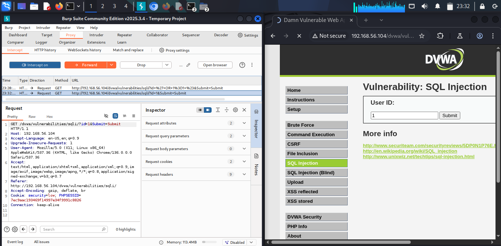
 
### Request Capture with Burp Suite
- I submitted a test User ID and captured the request to use with SQLMap.
- I needed the exact URL and parameters to test for SQL injection.
- **Steps**:
1. In Burp Suite, I made sure the proxy was active (Intercept was on).
2. In the SQL Injection module, I entered a test ID (`1`) and clicked “Submit”.
3. In Burp Suite’s “Proxy” tab, I found the intercepted request:
   
   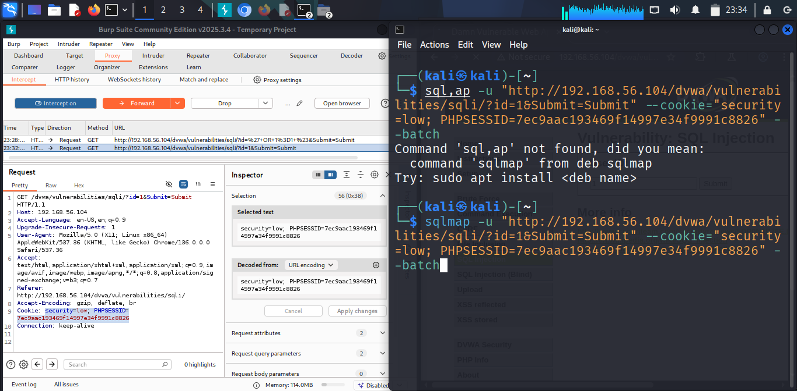
   
5. I noted the URL (`http://localhost/DVWA/vulnerabilities/sqli/?id=1&Submit=Submit`) and the `Cookie` value.

### Test for SQL Injection with SQLMap
- I used SQLMap to check if the `id` parameter was vulnerable to SQL injection.
- This confirmed whether I could exploit the form to extract data.
- **Steps**:
1. I opened a terminal.
2. I ran SQLMap:
   
3. SQLMap tested the `id` parameter and output:
   ```
   Parameter: id (GET)
   Type: boolean-based blind
   Type: error-based
   Type: UNION query
   ```
- **What did this mean?** The `id` parameter was vulnerable to SQL injection. SQLMap found multiple ways to exploit it, like:
- **Boolean-based blind**: Testing true/false conditions to extract data slowly.
- **Error-based**: Using database errors to leak information.
- **UNION query**: Combining the original query with my own to extract extra data.

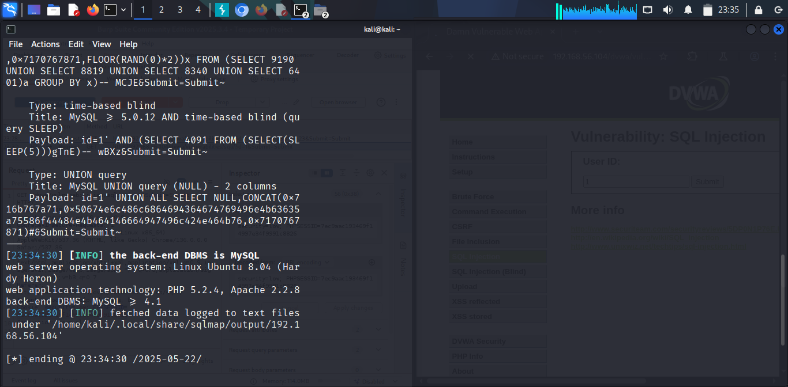

### Dumped Database Information
- I used SQLMap to list all databases on the server.
- This helped me find the database that DVWA uses, which might contain admin credentials.
- **Steps**:
1. I ran sqlmap as seen in the image.
2. SQLMap listed databases, including `dvwa`.
- The `dvwa` database was likely where DVWA stored its user data.

  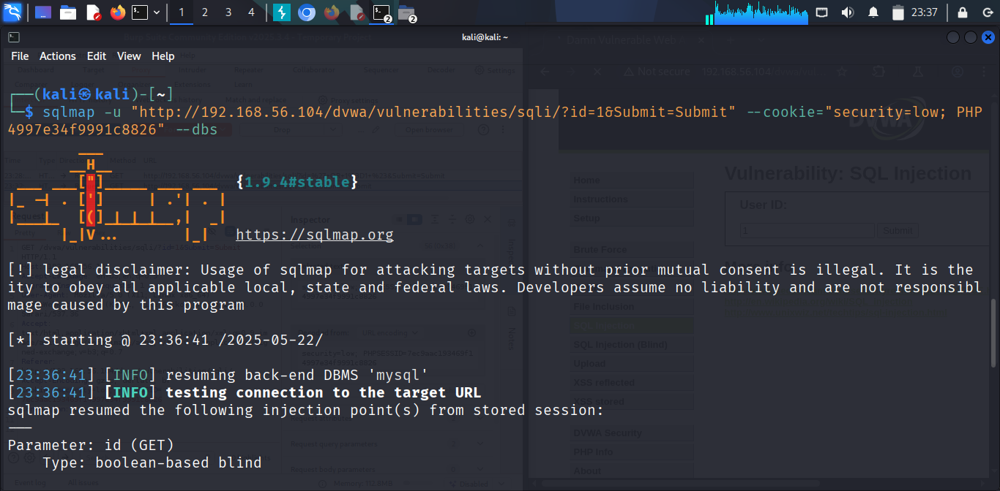

  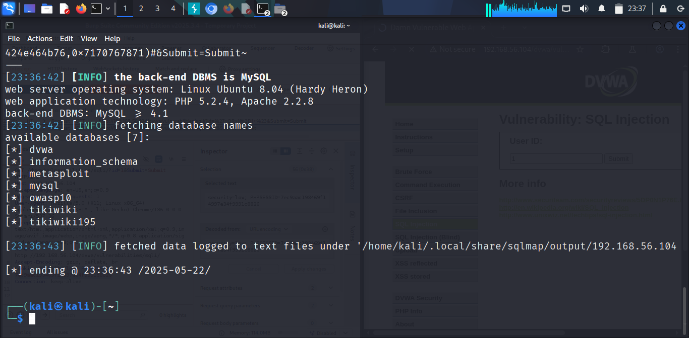

### Extracted Tables from the `dvwa` Database
- I listed the tables in the `dvwa` database.
- Tables might contain user information, like usernames and passwords.
- **Steps**:

  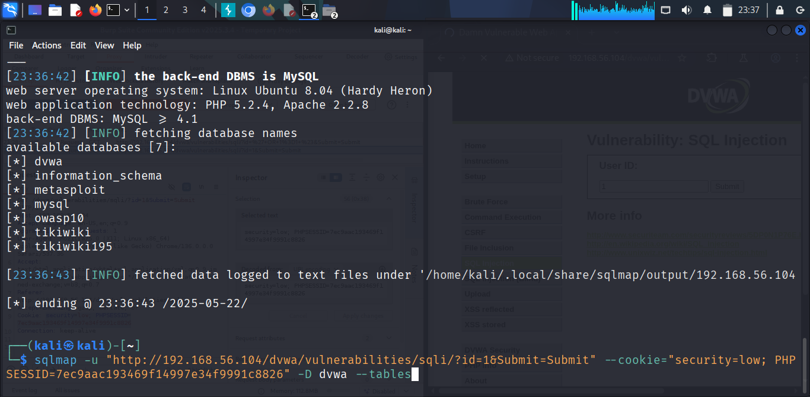

  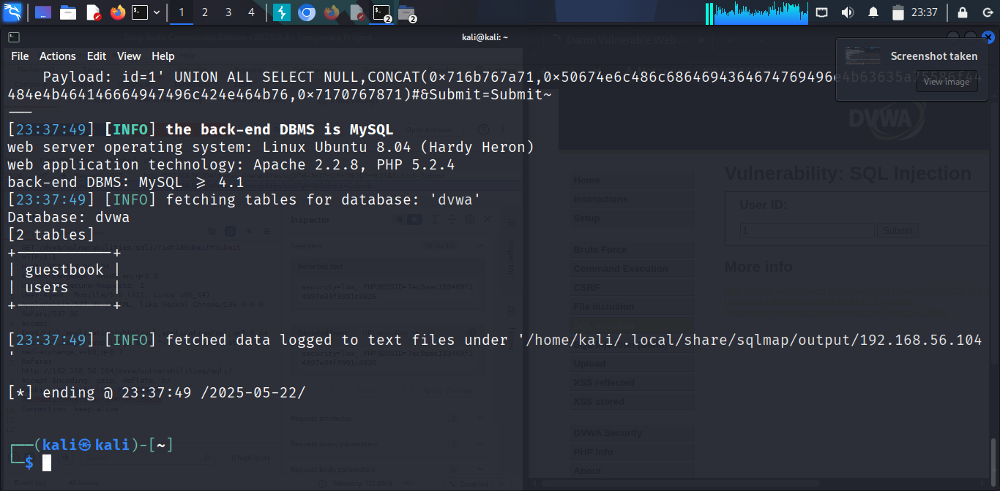

- The `users` table likely contained user credentials, which I needed to access the admin panel.

### Dumped the `users` Table
- I extracted all data from the `users` table.
- This table might have the admin’s username and password.
- **Steps**:
  
  1. I ran:

     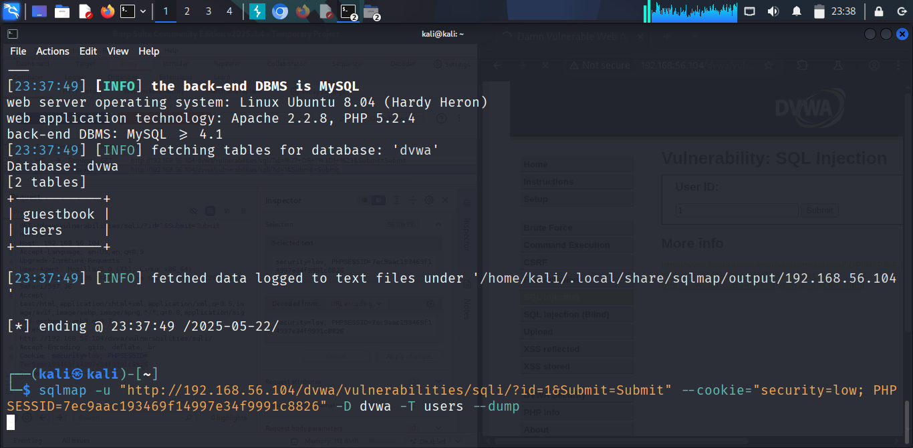
  
   - `-T users`: Specified the `users` table.
   - `--dump`: Extracted all data from the table.

### Cracked the Password Hashes with SQLMap
- I let SQLMap try to crack the MD5 hashes using a wordlist.
- I needed the plaintext password to log in as `admin`.
- **Steps**:
1. When SQLMap finished dumping the table, it asked me:
   ```
   do you want to crack the hashes? [Y/n]
   ```
   - I answered `Y` (Yes) because I wanted to find the plaintext password.
2. SQLMap then asked:
   ```
   do you want to use common password suffixes? [y/N]
   ```
   - I answered `y` (Yes). This meant SQLMap would add common endings (like `123`, `!`, or `2025`) to its wordlist passwords, increasing the chance of cracking the hash.
3. SQLMap used its built-in wordlist to crack the admin's hashed password and found:
   ```
   plaintext: password
   ```
- The admin’s password was `password`. 

     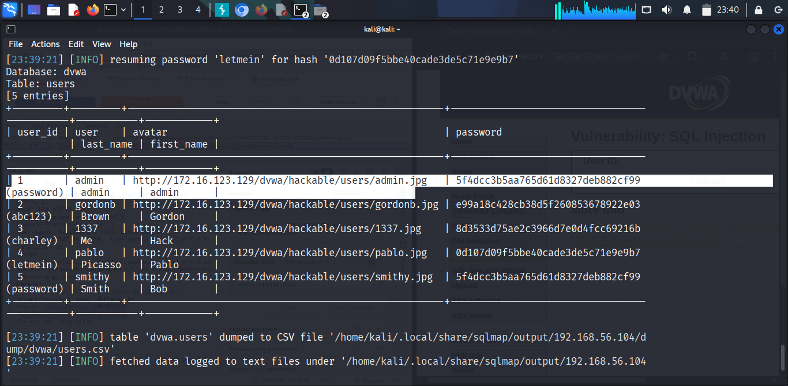


## Accessing the Admin Panel
- I used the cracked credentials to log in to DVWA.
- This completed my objective of accessing the admin panel.
- **Steps**:
1. I went to `http://localhost/DVWA/login.php`.
2. I logged out if I was already logged in.
3. I entered the credentials:
   - Username: `admin`
   - Password: `password`
4. I clicked “Login”. I was taken to the DVWA dashboard with admin access.
5. As an admin, I could access features like viewing all users or changing the security level.

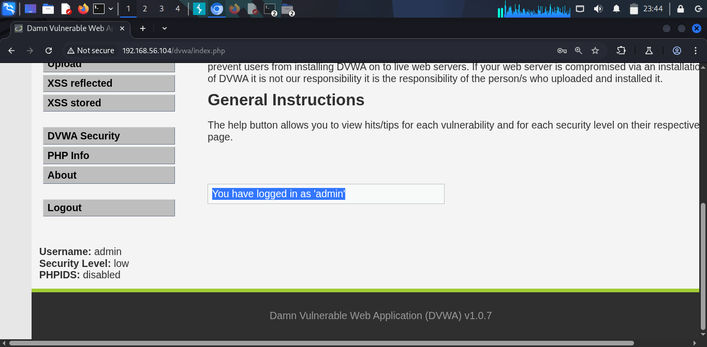

---

## Mitigation Recommendations
Now that I exploited the vulnerability, I’ll suggest ways to fix it so attackers can’t do the same.

### 1. Input Validation
- Checking all user inputs to make sure they’re safe before using them in a database query.

### 2. Use Parameterized Queries
- A way to write database queries where user inputs are treated as data, not code.
- Use prepared statements in PHP:
```php
$stmt = $mysqli->prepare("SELECT * FROM users WHERE id = ?");
$stmt->bind_param("i", $id); // "i" means integer
$stmt->execute();
```
Why is this important? It ensures user inputs can’t change the query’s structure, preventing SQL injection.

### 3. Deploy a Web Application Firewall (WAF)
- A WAF is a tool that filters web traffic to block malicious requests.
- Use a WAF like ModSecurity, which can be installed on the web server.
- **Why is this important?** It can detect and block SQL injection attempts before they reach the application.

### 4. Secure Coding Practices
Hash Passwords Properly:
- Don’t use MD5 (it’s outdated and easy to crack). Use a strong algorithm like bcrypt.
- Why? Bcrypt is much harder for attackers to crack.

Limit Failed Login Attempts:
- Lock accounts after too many failed logins to prevent brute-force attacks.

Secure Session Management:
- Use secure cookies and regenerate session IDs after login to prevent session hijacking.

----

## Challenges
|Challenge|Resolution|
|---------|----------|
|Login Bypass Attack failed|Used SQL Injection|

----

## Conclusion

In this project, I ethically hacked a website admin panel using DVWA. I first tried a login bypass attack, but it failed because SQLMap couldn’t detect the vulnerability. I then used the SQL Injection module to extract admin credentials with SQLMap, cracked the password hash, and logged in as admin. I documented the vulnerability, my attack steps, and suggested mitigations to secure the application.

This exercise showed me how dangerous SQL injection can be and why developers need to secure their applications. By practicing in a safe environment like DVWA, I learned valuable skills to help protect real websites in the future.

